# Waveshare Epaper Picture Frame

## Introduction

This project uses displays a image on an e-paper picture frame.  The picture switches once per day.  Included are the list of materials and how to build it.

## Knowledge Assumptions
I am assuming in this project that the user knows how to do the following:

* Be able to read a electrical schematic.
* Basic soldering of through hole components.
* Configure and build a project using the Arduino IDE.
* Be able to slice a 3d Model and send it to a 3d printer.
* Be able to use brass inserts using a soldering iron.
* Run a python script.

## File List

* [Documentation](./docs)
* [Gerber files](./gerber)
* [STL Files](./stl)
* [Freecad code](./freecad)
* [Arduino IDE code](./arduino)
* [Convert Images](./convert_images)
* [Sample SD Card Image](./sdcard_image)
* [License file](.license)

## Specifications

* Display Size 5x7 inches or 10x18cm.
* Battery life should be about a year with alkaline batteries.

## Parts List

### Basic Parts
| Item           | Quantity  		 | Notes |
| :---           | :---     		 | :--- |
| PLA            | 400g      		 | Used just plain black PLA |
| Picture frame  | 1                 | [Used 5x7 Vertical Side Natural Frame by Threshold from Target](https://www.target.com/p/5--34--x-7--34--vertical-sides-natural-frame-antique-wood---threshold--8482-/-/A-54562757) |
| Solder         | Small Amount      |   |

### Fasteners

| Item           | Quantity  		 | Notes |
| :---           | :---     		 | :--- |
| M2 x 6mm Phillips Flat Countersunk Head Machine Screws	| 2 |  |
| M2.5 x 8mm Phillips flathead Machine Screws               | 2 |  |
| \#4 x 1/2 inch Wood Screws                                | 5 | Alternative use M3 x 15mm Woodscrews |
| M2.5 x 5mm Pan Phillips Cross Head Machine screws         | 12 |  You could just use the flathead screws for all screws M2.5 screws   |
| M2 x 4mm Brass Inserts	                                | 14 |    |
| M2.5 x 5.8mm Brass Inserts                                | 12 |  There is room for longer inserts. |

### Electrical Parts

Note that all electronic parts are through hole.  Note that for the resistors, capacitors and diode there are many substitutes that can be used.

| Item           									 | Part Number         																						| Quantity  |
| :---           									 | :---                     																				| :---      |
| Waveshare 7.3 inch ACeP 7-Color E-Paper 800x600    | [7.3 inch e-Paper Hat (F)](https://www.waveshare.com/product/displays/e-paper/7.3inch-e-paper-hat-f.htm) | 1         |
| MicroSD Card                                       | MicroSD Card                                                                                             | 1         |
| MicroSD Card Adapter for Arduino                   | [MicroSD Card Adapter](https://www.amazon.com/Storage-Memory-Shield-Module-Arduino/dp/B01IPCAP72)        | 1         |
| 3 AAA Battery Holder                               | [3 AAA Battery Holder](https://www.amazon.com/Velleman-BH431A-Battery-Holder-AAA-Cell/dp/B003TZDNN4)    | 1         |  
| ATmega328-P-PU Arduino Bootloader                  | [3647-ATMEGA328P-PUArduinoBootloader-ND](https://www.digikey.com/en/products/detail/universal-solder-electronics-ltd/ATMEGA328P-PU-Arduino-Bootloader/16822123)  | 1         | 
| 28 Pin DIP Socket                                  | [ICM-328-1-GT-HT](https://www.digikey.com/en/products/detail/adam-tech/ICM-328-1-GT-HT/9832998)          | 1         |
| PMOS - LP0701N3-G                                  | [LP0701N3-G-ND](https://www.digikey.com/en/products/detail/microchip-technology/LP0701N3-G/4902364)      | 1         |
| 22pF Capacitor                                     | [K220J15C0GF5TL2](https://www.digikey.com/en/products/detail/vishay-beyschlag-draloric-bc-components/K220J15C0GF5TL2/286459) | 2         |
| 100nF	Capacitor   							     | [K104K15X7RF5TL2](https://www.digikey.com/en/products/detail/vishay-beyschlag-draloric-bc-components/K104K15X7RF5TL2/286538) | 3         |
| Diode General Purpose                              | [BAW75-TAP](https://www.digikey.com/en/products/detail/vishay-general-semiconductor-diodes-division/BAW75-TAP/4825763)       | 1         |
| 10K Resistor                                       | [CF14JT10K0](https://www.digikey.com/en/products/detail/stackpole-electronics-inc/CF14JT10K0/1741265)    | 1         |
| 100K Resistor                                              | [CF14JT100K](https://www.digikey.com/en/products/detail/stackpole-electronics-inc/CF14JT100K/1741263)    | 2         |        
| SW_Push SWITCH TACTILE SPST                        | [B3F-1000](https://www.digikey.com/en/products/detail/omron-electronics-inc-emc-div/B3F-1000/33150)      | 1         | 
| 16Mhz 20pF Crystal                                 | [ECS-160-20-1X](https://www.digikey.com/en/products/detail/ecs-inc/ECS-160-20-1X/827525)                 | 1         |

Need a male housing connector set row. DuPont style.  This is in order to make a 1x2, 1x6 and 1x8 Connectors.  Also (10Cm) short multicolor Dupont Female to Female wires.

Note that the Micro SD Card doesn't need much capacity.  A 1Gb Micro SD Card should work.

## Other Equipment Needed

### Other Hardware Needed

* 3D Printer
* Soldering Iron
* [Arduino FTDI USB to Serial 5v Programmers](https://www.amazon.com/Serial-Adapter-Female-FT232RL-Windows/dp/B07RBK2P47) 

Also a good idea to have troubleshooting equipment such as a multimeter and something to decode the SPI bus traffic.

### Software Needed

Need the software [Arduino IDE](https://www.arduino.cc/en/software) to build and download the code. I used version 2.1.0 but probably the latest version would work for you.

#### Arduino IDE Packages

| Package 														| Owner 			  | Current Version |
| :---    														| :---  			  | :---            |
| Arduino Builtin                                               | Arduino             | Built Into IDE  |
| [SD](https://www.arduino.cc/reference/en/libraries/sd/)      	| Arduino SparkFun    | 1.2.4           |
| [LowPower_LowPowerLab](https://www.arduino.cc/reference/en/libraries/lowpower_lowpowerlab/)  | LowerPowerLab       | 2.2 			|
| [EEPROM](https://docs.arduino.cc/learn/built-in-libraries/eeprom)	                           | Arduino                    | Built Into IDE  |
| [SPI](https://www.arduino.cc/reference/en/language/functions/communication/spi/)             | Arduino                    | Built Into IDE  |

### Python Environment

I used Python 3.9 with the Pillow (Python Image Library) 9.3.0 package installed.  The latest of each should work.

#### Optional Software

| Package 				| Version Used |
| :---    				| :---  	   |
| Freecad               | 0.21.2       |
| KiCad                 | 7.0          |

## Printing Instructions

### Printer Settings

| Settings  |  Used      |  Notes |
| :---      | :---       | :---   |
| Material  | PLA        |        |
| Nozzle    | 0.4mm      |        |
| Layer Height | 0.2mm   |        |
| Walls     | 5          | Needed for Brass Inserts |
| Infill    | 20%        |        |
| Supports  | Only Touching Build plate |   |

### 3D Printed Parts List

| Part          	|  Picture |
| :---          	| :---     |
| Main Part     	| 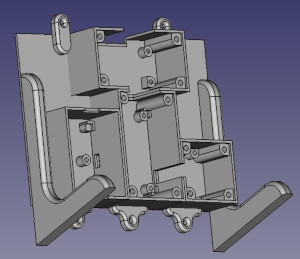 |
| Battery Cover 	| 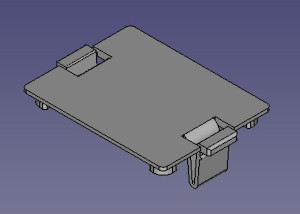  |
| SD Card Cover 	| 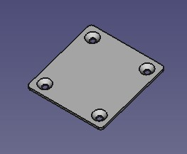  |
| Display HAT Cover | 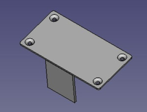   |
| Main Board Cover  | 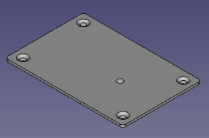  | 
| Frame Border      | 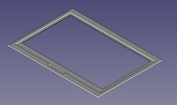  |

## PCB Board Instructions

Gerber files are listed in the gerber directory.    I used OshPark to create the PCBs, but you should be able to use other vendors.

## Assembly Instructions

### Insert the M2.5 Brass Inserts into the Following Holes

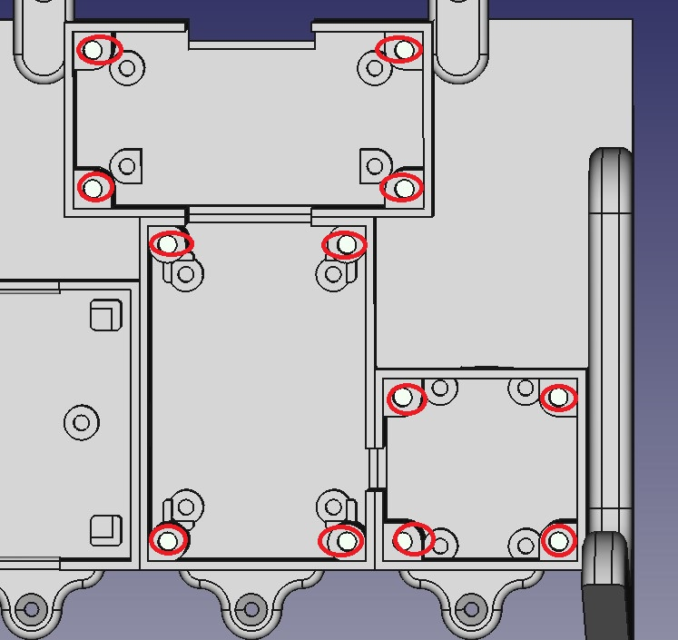

Use a solder gun to insert the brass inserts.

### Insert the M2 Brass Inserts into the Following Holes

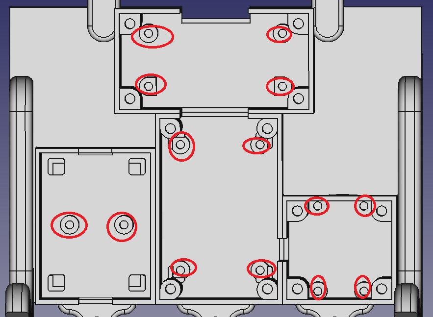

### Solder Components to PCB Board

Solder components to the PCB board.  The silk screen shows the Component number location.

| Component Number | Part  |
| :---             | :---  |
| C1, C2           | 22pF  | 
| C3, C4, C5       | 100nF |
| D1               | General Purpose Diode |
| J1, J2           | Male Connector 01x06 Pin   |
| J3	           | Male Connector 01x08 Pin   |
| J4	           | Male Connector 01x02 Pin   |
| Q1	           | PMOS - LP0701N3-G |
| R1               | 10K Resistor |
| R2, R3	       | 100K Resistor |
| SW1              | Push button switch |
| U1	           | 28 Pin Connector for ATmega328-P |
| Y1	           | 16Mhz Crystal |

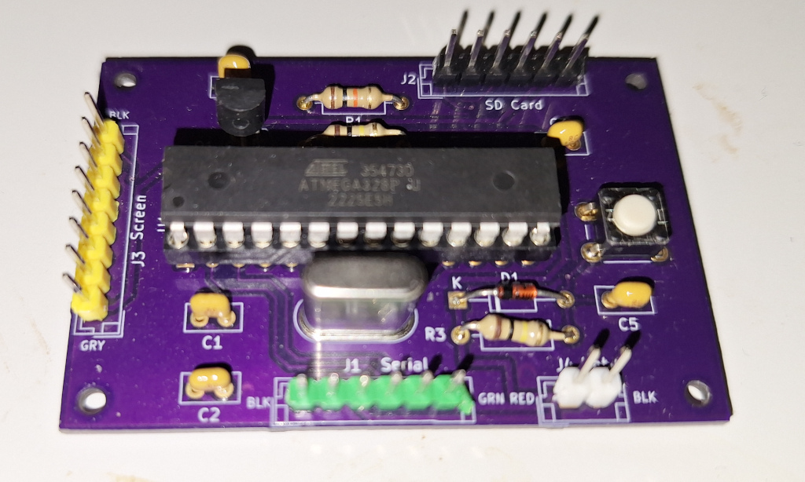

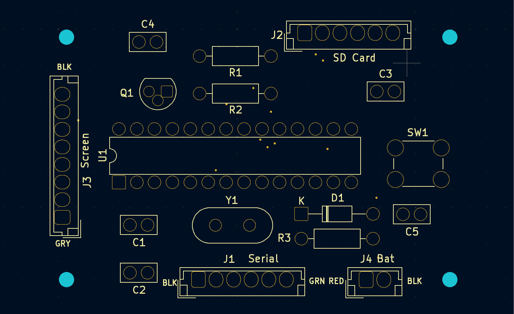

### Assemble Main Part to Frame

Remove the original back assembly from the picture frame. We do not need the back of the picture frame, the screws or the stand.  We only need the picture frame and the glass.

Mark Drill Holes.  (See frame back picture)
Drill holes using a 5/64 or 2mm drill bit into the picture frame.

Remove any stickers from the glass. Clean glass the glass using glass cleaner or isopropyl alcohol.   Ensure that no fingerprints are on the inside glass. 

Assemble in the following order:

1.  Wooden Frame
2.  Glass
3.  3D Printed Frame boarder
4.  E paper display (Be sure protective covering is removed and that the epaper display ribbon cable is at the top.)
5.  3D Printed Main Body

Use the #4 wood screw holes to attach the 3D Printed main body to the wooden picture frame.

### Put Boards into Main Picture Frame

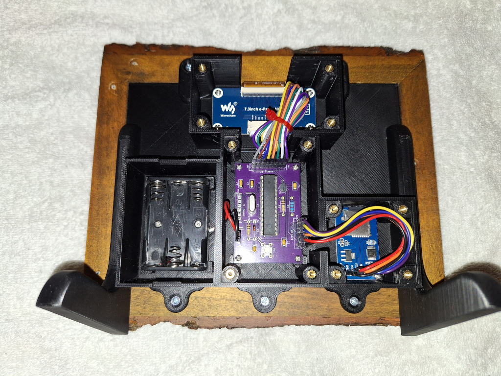

### Connect the Ribbon Cable to the E-Hat

The extension cable for the e-paper display is not needed.   Connect the ribbon cable from the display to the e-hat.  Use M2 roundhead screws to attach the e-hat.

### Attach the Battery Case

Push battery wires through hole in the main body.  Attach battery case used M2 Flathead screws.

### Attach the Other Components into the Main Board

SD Card Adapter and Main Board used M2 Roundhead screws.  Be sure that the hole in the main body for the SD Card matches SDCard slot.

Attach the main PCB board.  Make sure that the J3 screen is next to the hat connector and the SW1 is at the bottom of the display. 

### Make connections to PCB Board

Attach the battery to J4.  PCB board is marked red for positive and black for negative.

Attach SD card connections to J2.  Chip select is closest to R1.  Please double check [schematic](./docs/schematic.pdf).

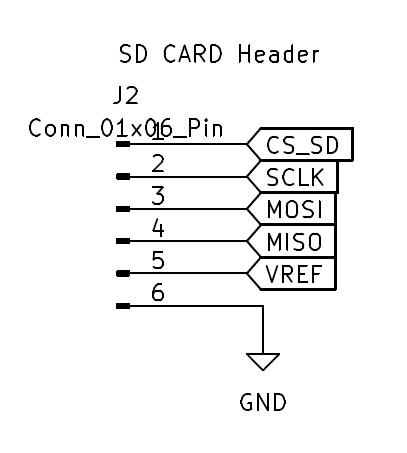

Attach the Waveshare ehat SPI connections to J3.  Gray should match GRY on the board.  Note that the BLK wire may be purple.

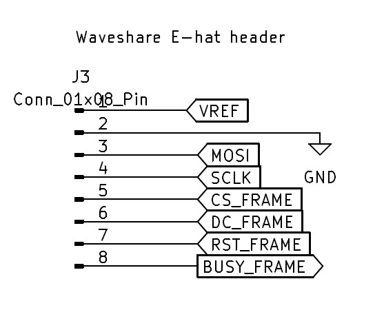

## Arduino Code 

### Arduino Code Overview

I had to make a couple changes to the Waveshare drivers.  They are:

   A.  Changes with Waveshare drivers (SPI frequency and chips select)
   B.  Reduced the SPI clock speed.

### Download Instructions

Use Board type "Arduino Uno"

Attach FTDI USB to serial connector to J1 serial connector. 

### Enable Serial Debug

If you run into problems you may want to enable serial debugging.  To enable serial debug out, uncomment line 50. 

<pre>
// Include this flag to turn on serial logging.
// #define SERIAL_DEBUG
</pre>

The last failure is saved in the eeprom.  When booting the errorcode is outputed over the serial port.   The errorcodes are listed in line 36 of debug.h.
<pre>
#define ERRORCODE_TEST                        0
#define ERRORCODE_EPAPER_INIT_FAILED          0x101
.
.
</pre>

## Python Code

### Preprocessing Portrait Images

Images that are formatted as portrait may need to be cropped so that faces and important details may be shown.

### Python Command line Arguments

<pre>
	convert_images.py &lt;Source Directory&gt;  &lt;Destinations Directory&gt;
</pre>	
	
This command converts any images from the source directory or its children and into the destination directory.

Images are listed in the following order:  pic_000.bmp, pic_001.bmp, pic_002.bmp etc.

This program also does the following:  

1.  Auto adjust the contrast.
2.  Turns up saturation so that the images don't look washed out.
3.  Mirrors the image so that it looks correct from the picture frame.
4.  Crops the image so the image size is correct.
5.  Dithers the images so that only 7 colors are needed to display the image.
6.  Randomizes the image's order.

## SD Card

## Sample SDCard Image

A sample sdcard image is located in:

### SD Card Format and Files

The Micro SD Card doesn't have to be large since the images don't take up much space.  Format a Micro SD Card using Fat32.  Copy the processed image files to the root of the Micro SD Card.

Insert Micro SD Card into the Micro SDCard Adapter for Arduino.

##  Testing and Putting it Together

Verify that the image appears on the e-paper display.

Attach the 3D printed covers.  

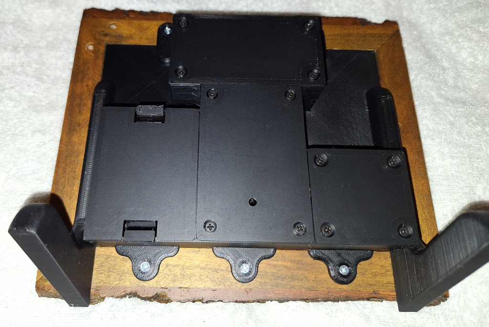

### Additional Resources

[Waveshare 7.3inch e-Paper HAT (F) Manual](https://www.waveshare.com/wiki/7.3inch_e-Paper_HAT_(F))

[e Paper with Arduino and Raspberry Pi](https://www.youtube.com/watch?v=4onIqHClh2s&t=601s)

[Trolling My Mom With an E-Paper Picture](https://youtu.be/YawP9RjPcJA)
	

